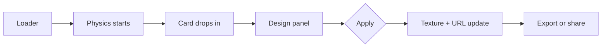
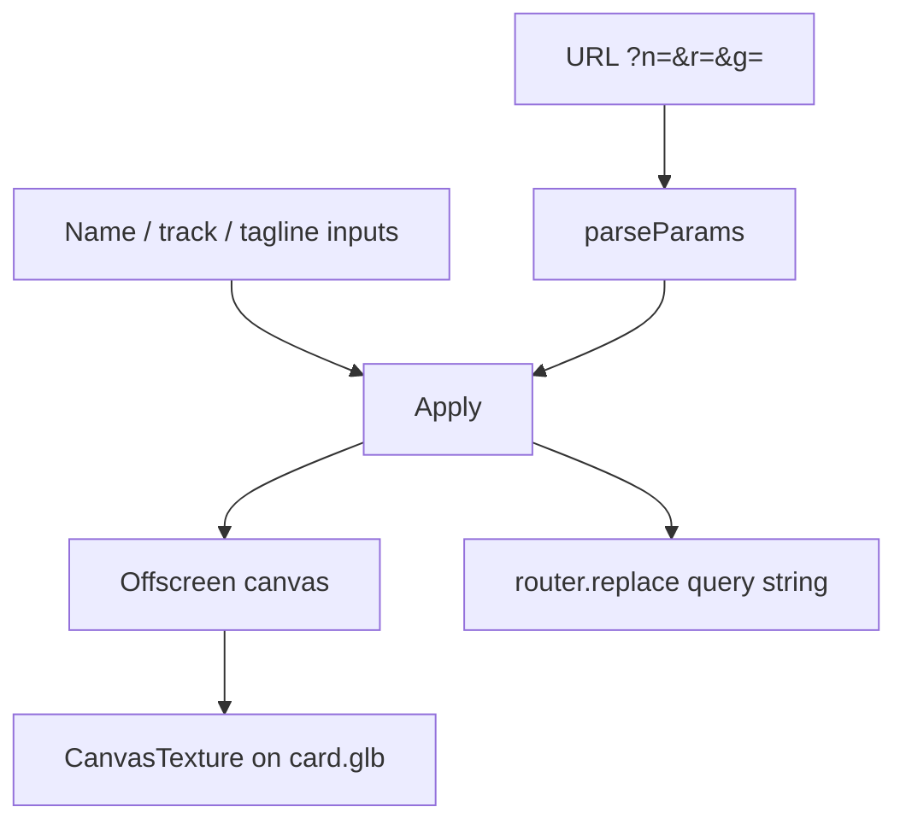

# Cursor × Toronto Tech Week Lanyard

The event site and 3D lanyard designer for **Canada's largest Cursor event**, happening during [Toronto Tech Week](https://torontotechweek.com) on **May 27, 2026**.

Visitors land on a physics-driven badge they can grab, swing, personalize, export, and share — then register on [Luma](https://luma.com/11fprizv). Live at [cursor-ttw-lanyard.vercel.app](https://cursor-ttw-lanyard.vercel.app).

## What this is

This is a marketing site and a badge studio in one page. The lanyard is not a static render: it is a live Rapier simulation of a card hanging from a fabric band. Attendees type their name, pick a track, add a handle or school, and the text is painted onto the 3D card texture in the browser.

Three things it is built to do well:

**Feel like an IRL badge** — A GLB card, MeshLine band, and Rapier rope joints give the lanyard weight. You can drag it. Gravity, damping, and a spawn drop are all real physics, paused until the intro loader finishes so the first frame is not a glitch.

**Make it yours and send it** — Name, track (Engineer, Designer, Product Manager, Founder), and a tagline bake onto the card. The URL updates with those fields, so a link is a shareable badge. Open Graph images are generated from the same fields, so X and LinkedIn previews show the attendee, not a generic poster.

**Take it with you** — Export the front or back as PNG, or record the entrance drop as video or GIF. Recording respects `prefers-reduced-motion` and shortens the capture when the user asks for less motion.

There is no backend account, no login, and no database. State lives in the URL.

## How it works

### Landing experience

The home page is a dark, full-viewport stage. After a short Cursor-branded loader, physics starts and the card drops in. On desktop the copy sits on the left and the lanyard fills the rest of the frame. On mobile the lanyard sits above the copy so the badge stays large enough to drag.



### Personalizing the card

Typing in the panel does not immediately rewrite the 3D mesh. **Apply** copies the fields onto the live card so mid-edit text does not flicker on the GPU texture.

Under the hood:

1. Query params (`n`, `r`, `g`) are parsed and sanitized (control characters stripped, 32-character cap, track must match a known role).
2. The card's base map is copied onto an offscreen canvas.
3. Name, track, and tagline are drawn in JetBrains Mono, wrapped and scaled so they stay inside the badge layout.
4. That canvas becomes a Three.js texture on the GLB material.



### Shareable URLs

A designed lanyard is just a URL. Example:

```
https://cursor-ttw-lanyard.vercel.app/?n=Haaris&r=Engineer&g=@haaris
```

| Param | Meaning | Notes |
|---|---|---|
| `n` | Name | Required for a named badge. Uppercased on the card. |
| `r` | Track | One of `Engineer`, `Designer`, `Product Manager`, `Founder`. |
| `g` | Tagline | Handle, company, school — drawn on the opposite side of the name. |

Share actions copy that canonical URL, or open X / LinkedIn with it. The `/lanyard` route uses the same params and generates matching Open Graph metadata so a pasted link previews the attendee.

### Export pipeline

Exports read the WebGL canvas (`preserveDrawingBuffer` is on for this reason):

| Action | What happens |
|---|---|
| **Front** | Snapshot the current view as PNG. |
| **Back** | Flip the card, wait a beat, snapshot, restore. |
| **Video** | 3-second countdown, reset the drop, `captureStream(30)` + `MediaRecorder` (~11s, or ~4s if reduced motion). MP4 when the browser supports it, otherwise WebM. |
| **GIF** | Same capture, then `modern-gif` encodes frames at 480px wide / 15 fps. |

Only one capture runs at a time. The UI shows a countdown, a recording pill, and an encoding state for GIFs.

### Open Graph images

`/api/og` is a Next.js `ImageResponse` route. It reads the same `n` / `r` / `g` params and draws a 1200×630 card in JetBrains Mono on `#131315`. Social crawlers never have to load WebGL.

Set `NEXT_PUBLIC_SITE_URL` in production so OG URLs point at the real origin instead of localhost. It defaults to `https://cursor-ttw-lanyard.vercel.app`.

## Tech stack

| Layer | Technology |
|---|---|
| App | Next.js 16 (App Router), React 19, TypeScript |
| UI | Tailwind CSS 4, shadcn/ui, Motion, Lucide |
| 3D | Three.js, React Three Fiber, Drei, MeshLine |
| Physics | `@react-three/rapier` (Rapier) |
| Export | Canvas `toDataURL`, `MediaRecorder`, `modern-gif` |
| Social | Next.js OG `ImageResponse`, X and LinkedIn share URLs |
| Analytics | Vercel Analytics, Speed Insights |
| Deploy | Vercel |

Package manager is **pnpm**.

## Prerequisites

- **Node.js 20+** (Next.js 16)
- **pnpm** (`corepack enable` then `corepack prepare pnpm@latest --activate`, or [install pnpm](https://pnpm.io/installation))
- A Chromium-based browser for the most reliable video export (Safari/Firefox may fall back to WebM or skip recording)

No API keys are required to run the site locally. Registration still goes out to Luma.

## Setup

```bash
git clone https://github.com/Haaris-7/Cursor-Toronto-Tech-Week-Event-Lanyard.git
cd Cursor-Toronto-Tech-Week-Event-Lanyard
pnpm install
```

Optional: copy an env file and set the public site URL used in metadata and OG images.

```bash
# .env.local
NEXT_PUBLIC_SITE_URL=http://localhost:3000
```

## How to run

| Command | Purpose |
|---|---|
| `pnpm dev` | Next.js dev server with HMR |
| `pnpm build` | Production build |
| `pnpm start` | Serve the production build |
| `pnpm lint` | ESLint |

The app runs at [localhost:3000](http://localhost:3000).

## Using the lanyard

1. Wait out the loader so physics can start.
2. Drag the card. It should swing on the band, not teleport.
3. Enter a **name** (required for a named badge), pick a **track**, optionally add a **tagline**.
4. Click **Apply**. The texture and the URL both update.
5. Export front/back stills, or record video/GIF of the drop-in.
6. Share the link, or post to X / LinkedIn from the panel.
7. **Register on Luma** from the hero CTA when you are ready for the actual event.

On a shared link, the page hydrates fields from the query string so the recipient sees the same badge.

## Project structure

```
.
├── app/
│   ├── page.tsx              # Home: hero + sponsors
│   ├── layout.tsx            # Fonts, metadata, header/footer, loader
│   ├── lanyard/page.tsx      # Dedicated lanyard route + per-attendee OG
│   ├── api/og/route.tsx      # Dynamic Open Graph image
│   └── globals.css
├── components/
│   ├── hero-section.tsx      # Event copy + 3D stage
│   ├── lanyard-with-controls.tsx  # Design panel, export, share
│   ├── lanyard-page.tsx
│   ├── ui/lanyard.tsx        # Rapier scene, rope, textured GLB
│   ├── header.tsx / footer.tsx / loader.tsx
│   └── sponsor-carousel.tsx
├── lib/
│   ├── lanyard-params.ts     # Parse / serialize n, r, g
│   ├── share.ts              # Clipboard, X, LinkedIn
│   └── utils.ts
├── public/
│   ├── card.glb              # Badge mesh
│   ├── card-base-*.png       # Print textures
│   └── cursor-brand-assets/  # Official Cursor marks
└── package.json
```

## Event details

| | |
|---|---|
| Event | Cursor × Toronto Tech Week |
| Date | May 27, 2026 |
| Register | [luma.com/11fprizv](https://luma.com/11fprizv) |
| Live site | [cursor-ttw-lanyard.vercel.app](https://cursor-ttw-lanyard.vercel.app) |
| Built by | [Haaris Sadiq](https://www.linkedin.com/in/haarissadiq/) |

Sponsors currently listed on the site: WisprFlow (platinum); Drive Capital, Composio, Boardy, Carousel Studio (gold); Valsea, ElevenLabs, Squid Media (silver); BrainStation (bronze).
